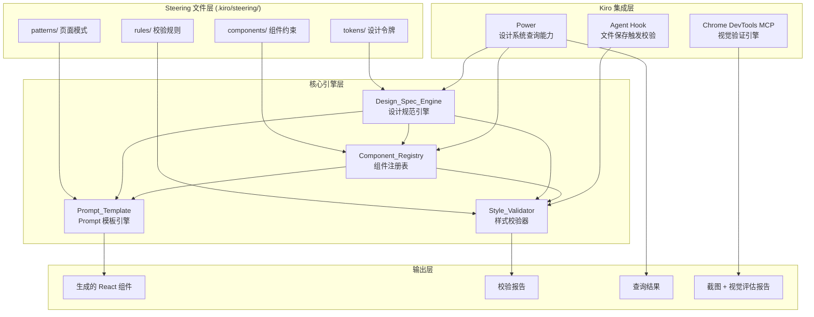
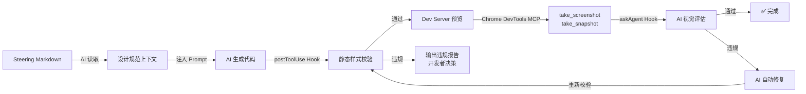
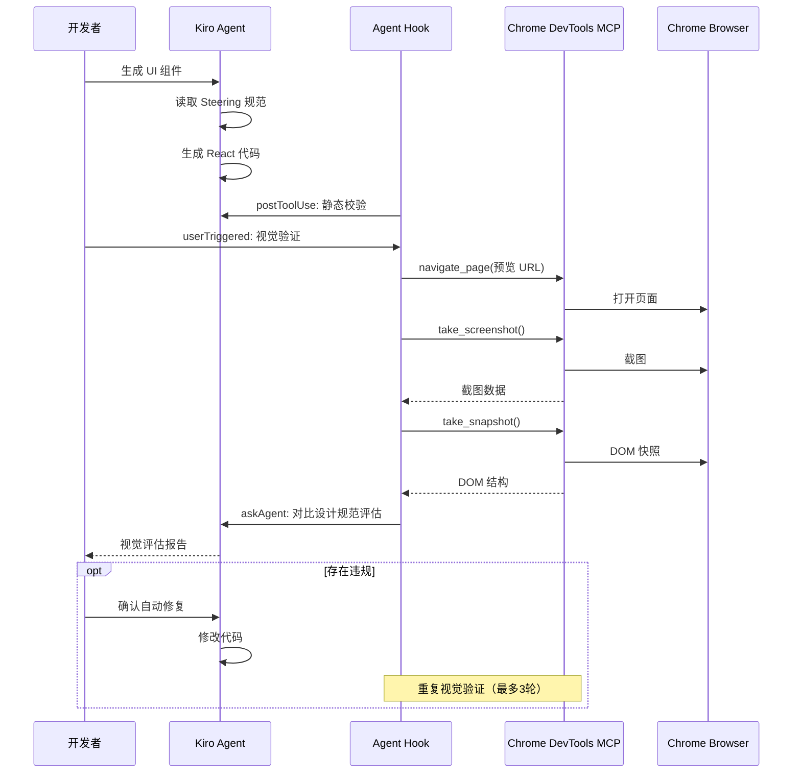

# 技术设计文档：Code-as-Design 工作流系统

## 概述

本设计文档描述 Code-as-Design 工作流系统的技术架构，该系统为医院信息系统（HIS）提供一套完全在代码环境内完成 UI 设计与开发的工作流。系统利用 Kiro 的三大核心能力——Steering 文件（纯文本设计规范）、Agent Hooks（自动化校验）和 Powers（可复用查询能力），实现设计规范的定义、校验和代码生成的全流程自动化。

技术栈：React + TypeScript + Tailwind CSS + shadcn/ui

核心设计决策：
- 设计规范以 Markdown 格式存储在 `.kiro/steering/` 目录下，作为 AI 代码生成的唯一设计来源
- 严格禁止手写自定义 CSS 类和内联样式，所有样式通过 Tailwind CSS 工具类表达
- 采用"积木式"（Block Composition）策略拆分页面，每个 Block 独立生成、独立校验
- 设计令牌（Design Token）到 Tailwind 类名的映射是系统的核心数据流

## 架构

### 系统架构总览



### 端到端数据流（含视觉验证闭环）



### Chrome DevTools MCP 集成架构



### 模块职责划分

| 模块 | 职责 | 输入 | 输出 |
|------|------|------|------|
| Design_Spec_Engine | 解析/序列化 Steering 文件，管理 Design Token | Markdown 文件 | Token 数据结构、Tailwind 映射 |
| Component_Registry | 管理组件约束规则，校验组件用法 | 组件约束 Markdown | 约束规则集、校验结果 |
| Style_Validator | 校验生成代码的样式合规性 | JSX/TSX 源码 | 结构化校验报告 |
| Prompt_Template | Block 拆分与 Prompt 组装 | 页面描述、Token 子集 | Block 代码文件 |


## 组件与接口

### 1. Design_Spec_Engine（设计规范引擎）

设计规范引擎是系统的核心模块，负责 Steering 文件的解析、序列化和令牌管理。

```typescript
// src/engine/design-spec-engine.ts

interface DesignSpecEngine {
  /** 从 Steering 目录解析所有 Design Token */
  parseTokens(steeringDir: string): ParseResult<DesignTokenMap>;

  /** 将 Design Token 数据结构序列化为 Markdown */
  serialize(tokens: DesignTokenMap, options?: SerializeOptions): string;

  /** 按类别和关键词查询令牌 */
  queryTokens(query: TokenQuery): DesignToken[];

  /** 校验 Steering 文件语法和引用关系 */
  validate(steeringDir: string): DiagnosticReport;

  /** 将 Design Token 映射为 Tailwind CSS 类名 */
  mapToTailwind(token: DesignToken): TailwindMapping;

  /** 推荐 HIS 业务场景的页面布局和组件组合 */
  recommendPattern(scenario: string): PatternRecommendation;
}

interface ParseResult<T> {
  success: boolean;
  data?: T;
  diagnostics: Diagnostic[];
}

interface SerializeOptions {
  preserveComments: boolean;
  preserveFormatting: boolean;
}

interface Diagnostic {
  file: string;
  line: number;
  column: number;
  severity: 'error' | 'warning' | 'info';
  message: string;
  suggestion?: string;
}

interface DiagnosticReport {
  diagnostics: Diagnostic[];
  /** 按严重程度统计 */
  summary: { errors: number; warnings: number; infos: number };
}
```

### 2. Component_Registry（组件注册表）

```typescript
// src/registry/component-registry.ts

interface ComponentRegistry {
  /** 从 Steering 文件解析组件约束规则 */
  loadConstraints(steeringDir: string): ParseResult<ComponentConstraint[]>;

  /** 查询单个组件的完整约束 */
  getConstraint(componentName: string): ComponentConstraint | null;

  /** 列出所有已注册组件及摘要 */
  listComponents(): ComponentSummary[];

  /** 校验组件用法是否合规 */
  validateUsage(usage: ComponentUsage): ValidationResult;

  /** 模糊匹配最相似的已注册组件 */
  findSimilar(name: string): string[];
}

interface ComponentConstraint {
  name: string;
  allowedProps: PropConstraint[];
  forbiddenCombinations: PropCombination[];
  defaults: Record<string, unknown>;
  parentConstraint?: string;        // 父组件限制
  mutuallyExclusive?: string[][];   // 互斥属性组
  examples: CodeExample[];
  forbiddenUsages: CodeExample[];
}

interface PropConstraint {
  name: string;
  type: string;
  required: boolean;
  allowedValues?: unknown[];
}

interface ComponentUsage {
  componentName: string;
  props: Record<string, unknown>;
  parentComponent?: string;
  children?: ComponentUsage[];
}

interface ValidationResult {
  valid: boolean;
  violations: Violation[];
}

interface Violation {
  type: 'unknown_component' | 'forbidden_prop' | 'missing_required' | 'invalid_parent' | 'mutual_exclusion';
  message: string;
  suggestion?: string;
}
```

### 3. Style_Validator（样式校验器）

```typescript
// src/validator/style-validator.ts

interface StyleValidator {
  /** 校验单个文件 */
  validateFile(filePath: string): StyleValidationReport;

  /** 校验目录下所有 JSX/TSX 文件 */
  validateDirectory(dirPath: string): StyleValidationReport;

  /** 检查内联样式 */
  checkInlineStyles(ast: JSXNode[]): StyleViolation[];

  /** 检查自定义 CSS 类 */
  checkCustomClasses(ast: JSXNode[]): StyleViolation[];

  /** 检查颜色值合规性 */
  checkColorCompliance(ast: JSXNode[], tokens: DesignTokenMap): StyleViolation[];

  /** 检查间距值合规性（4px 网格） */
  checkSpacingCompliance(ast: JSXNode[], tokens: DesignTokenMap): StyleViolation[];
}

interface StyleViolation {
  file: string;
  line: number;
  column: number;
  severity: 'error' | 'warning' | 'info';
  type: 'inline_style' | 'custom_class' | 'invalid_color' | 'invalid_spacing' | 'unknown_component';
  message: string;
  currentCode: string;
  suggestedFix: string;
}

interface StyleValidationReport {
  totalViolations: number;
  violations: StyleViolation[];
  skippedFiles: Array<{ file: string; reason: string }>;
  summary: {
    errors: number;
    warnings: number;
    infos: number;
  };
}
```

### 4. Prompt_Template（Prompt 模板引擎）

```typescript
// src/prompt/prompt-template.ts

interface PromptTemplate {
  /** 将页面拆分为 Block 方案 */
  splitIntoBlocks(pageLayout: PageLayout): BlockPlan;

  /** 为单个 Block 生成 Prompt */
  generateBlockPrompt(block: Block, context: BlockContext): string;

  /** 生成 Block 组合代码 */
  generateComposition(blocks: Block[]): string;

  /** 获取 HIS 预置页面模板 */
  getPresetTemplate(templateType: HISTemplateType): PageLayout;
}

type HISTemplateType = 'list' | 'detail' | 'form' | 'dashboard';

interface PageLayout {
  name: string;
  description: string;
  blocks: BlockDefinition[];
}

interface BlockDefinition {
  name: string;
  responsibility: string;
  expectedComponents: string[];
}

interface Block extends BlockDefinition {
  tokenSubset: DesignToken[];
  constraintSubset: ComponentConstraint[];
}

interface BlockPlan {
  blocks: Block[];
  dataFlow: DataFlowDefinition[];
}

interface DataFlowDefinition {
  from: string;
  to: string;
  mechanism: 'props' | 'context';
  dataShape: string;
}

interface BlockContext {
  tokens: DesignToken[];
  constraints: ComponentConstraint[];
  dataFlow: DataFlowDefinition[];
  maxLines: number; // 默认 200
}
```

### 5. Kiro 集成接口

#### Agent Hook 配置

```typescript
// .kiro/hooks/style-validation-hook.ts

interface AgentHookConfig {
  trigger: 'on_file_save';
  filePattern: '**/*.{jsx,tsx}';
  action: 'style_validation';
}

// Hook 执行流程：
// 1. 文件保存事件触发
// 2. 加载 Steering 文件中的 Design Token 和组件约束
// 3. 解析保存的 JSX/TSX 文件 AST
// 4. 执行样式校验（内联样式、自定义类、颜色、间距）
// 5. 执行组件用法校验
// 6. 输出结构化校验报告
```

#### Power 查询接口

```typescript
// .kiro/powers/design-system-power.ts

interface DesignSystemPower {
  /** 查询设计令牌 */
  queryToken(params: { category?: TokenCategory; keyword?: string }): DesignToken[];

  /** 浏览组件列表 */
  browseComponents(): ComponentSummary[];

  /** 查询组件详情 */
  getComponentDetail(name: string): ComponentDetail;

  /** 推荐设计模式 */
  recommendPattern(scenario: string): PatternRecommendation;
}

interface ComponentSummary {
  name: string;
  description: string;
  propCount: number;
  hasHISPreset: boolean;
}

interface ComponentDetail {
  constraint: ComponentConstraint;
  examples: CodeExample[];
  forbiddenUsages: CodeExample[];
  relatedComponents: string[];
}

interface PatternRecommendation {
  layout: PageLayout;
  rationale: string;
  relatedTokens: DesignToken[];
}

interface CodeExample {
  description: string;
  code: string;
}
```

#### Chrome DevTools MCP 集成配置

```jsonc
// .kiro/settings/mcp.json
{
  "mcpServers": {
    "chrome-devtools": {
      "command": "npx",
      "args": [
        "-y",
        "chrome-devtools-mcp@latest",
        "--headless"
      ],
      "disabled": false,
      "autoApprove": [
        "take_screenshot",
        "take_snapshot",
        "navigate_page",
        "resize_page",
        "evaluate_script",
        "lighthouse_audit"
      ]
    }
  }
}
```

#### 视觉验证 Agent Hook 配置

```jsonc
// .kiro/hooks/visual-review.json
// userTriggered 类型：开发者手动触发视觉验证
{
  "name": "Visual Design Review",
  "version": "1.0.0",
  "description": "通过 Chrome DevTools MCP 截图并对比设计规范进行视觉评估",
  "when": {
    "type": "userTriggered"
  },
  "then": {
    "type": "askAgent",
    "prompt": "请执行视觉设计验证流程：\n1. 使用 chrome-devtools MCP 的 navigate_page 工具打开当前项目的开发服务器预览页面\n2. 使用 take_screenshot 截取当前页面\n3. 使用 take_snapshot 获取 DOM 结构快照\n4. 对照 .kiro/steering/ 中的设计规范（颜色体系、间距系统、数据密度模式、组件约束）评估截图\n5. 检查维度：品牌色合规性、间距网格合规性、组件变体正确性、HIS 数据密度、布局结构\n6. 使用 resize_page 分别模拟 1920x1080、1366x768、1280x1024 三种分辨率并截图对比\n7. 使用 lighthouse_audit 进行无障碍性审计\n8. 输出结构化视觉评估报告，包含各维度的合规/违规状态、截图对比和修复建议"
  }
}
```

```jsonc
// .kiro/hooks/post-generate-visual-check.json
// postToolUse 类型：AI 写入文件后自动提醒视觉验证
{
  "name": "Post-Generate Visual Check Reminder",
  "version": "1.0.0",
  "description": "AI 生成 UI 代码后提醒进行视觉验证",
  "when": {
    "type": "postToolUse",
    "toolTypes": ["write"]
  },
  "then": {
    "type": "askAgent",
    "prompt": "刚刚写入了文件。如果这是一个 UI 组件（.tsx/.jsx），请提醒开发者：可以点击 'Visual Design Review' Hook 按钮来触发视觉验证，通过 Chrome DevTools MCP 截图对比设计规范。同时进行静态样式校验：检查是否存在内联 style 属性、自定义 CSS 类名、未定义的颜色值或不符合 4px 网格的间距值。"
  }
}
```

### 6. Steering 文件目录结构

```
.kiro/steering/
├── tokens/
│   ├── colors.md          # 颜色令牌（品牌色、语义色、中性色）
│   ├── spacing.md         # 间距令牌（4px 网格体系）
│   ├── typography.md      # 排版令牌（字体、字号、行高）
│   ├── borders.md         # 圆角和边框令牌
│   ├── shadows.md         # 阴影令牌
│   └── breakpoints.md     # 断点令牌
├── components/
│   ├── data-table.md      # 数据表格约束（HIS 预置）
│   ├── stat-card.md       # 统计卡片约束（HIS 预置）
│   ├── timeline.md        # 时间线约束（HIS 预置）
│   ├── form-layout.md     # 表单布局约束（HIS 预置）
│   └── ...                # 其他组件约束
├── patterns/
│   ├── list-page.md       # 列表页模板
│   ├── detail-page.md     # 详情页模板
│   ├── form-page.md       # 表单页模板
│   ├── dashboard-page.md  # 仪表盘页模板
│   └── his-density.md     # HIS 数据密度模式
├── rules/
│   ├── style-rules.md     # 样式校验规则
│   ├── his-semantic.md    # HIS 语义色彩规范
│   ├── his-icons.md       # HIS 图标规范
│   └── data-masking.md    # 数据脱敏规则
└── _imports.md            # 模块化导入声明
```

## 数据模型

### Design Token 数据模型

```typescript
// src/models/design-token.ts

type TokenCategory = 'color' | 'spacing' | 'fontSize' | 'borderRadius' | 'shadow' | 'breakpoint';

interface DesignToken {
  /** 令牌唯一标识，如 "color.primary.500" */
  id: string;
  /** 令牌类别 */
  category: TokenCategory;
  /** 令牌原始值，如 "#3B82F6" 或 "16px" */
  value: string;
  /** 对应的 Tailwind CSS 类名，如 "text-primary-500" */
  tailwindClass: string;
  /** 令牌描述 */
  description?: string;
  /** 来源 Steering 文件路径 */
  sourceFile: string;
  /** 来源行号 */
  sourceLine: number;
}

interface DesignTokenMap {
  tokens: Map<string, DesignToken>;
  /** 按类别索引 */
  byCategory: Map<TokenCategory, DesignToken[]>;
}

/** Tailwind 映射结果 */
interface TailwindMapping {
  token: DesignToken;
  /** Tailwind 工具类名 */
  className: string;
  /** 对应的 CSS 属性 */
  cssProperty: string;
  /** 对应的 CSS 值 */
  cssValue: string;
}
```

### 颜色令牌体系

```typescript
// src/models/color-tokens.ts

interface ColorSystem {
  /** 品牌主色 */
  primary: ColorScale;
  /** 辅助色 */
  secondary: ColorScale;
  /** 语义色 */
  semantic: {
    success: ColorScale;
    warning: ColorScale;
    error: ColorScale;
    info: ColorScale;
  };
  /** 中性色阶 */
  neutral: ColorScale;
  /** HIS 专用语义色 */
  his: {
    patientStatus: {
      admitted: string;    // 入院-蓝
      inHospital: string;  // 在院-绿
      discharged: string;  // 出院-灰
      critical: string;    // 危急-红
    };
    orderStatus: {
      pending: string;     // 待执行-橙
      executing: string;   // 执行中-蓝
      completed: string;   // 已完成-绿
      cancelled: string;   // 已取消-灰
    };
  };
}

interface ColorScale {
  50: string;
  100: string;
  200: string;
  300: string;
  400: string;
  500: string;
  600: string;
  700: string;
  800: string;
  900: string;
}
```

### 间距系统

```typescript
// src/models/spacing-tokens.ts

/** 4px 基准网格的间距体系 */
interface SpacingSystem {
  /** 基准单位 4px */
  base: 4;
  /** 允许的间距值（4px 的倍数） */
  scale: readonly [4, 8, 12, 16, 20, 24, 32, 40, 48, 64];
  /** 间距值到 Tailwind 类名的映射 */
  tailwindMap: Record<number, string>;
}

// Tailwind 映射示例：
// 4  -> "p-1"  / "m-1"  / "gap-1"
// 8  -> "p-2"  / "m-2"  / "gap-2"
// 12 -> "p-3"  / "m-3"  / "gap-3"
// 16 -> "p-4"  / "m-4"  / "gap-4"
// ...
```

### HIS 数据密度模式

```typescript
// src/models/his-density.ts

type DensityLevel = 'compact' | 'standard' | 'comfortable';

interface DensityConfig {
  level: DensityLevel;
  lineHeight: string;
  spacing: {
    rowGap: number;
    cellPadding: number;
    sectionGap: number;
  };
  fontSize: {
    body: string;
    caption: string;
    header: string;
  };
}

const DENSITY_PRESETS: Record<DensityLevel, DensityConfig> = {
  compact: {
    level: 'compact',
    lineHeight: '1.25',
    spacing: { rowGap: 4, cellPadding: 4, sectionGap: 8 },
    fontSize: { body: '12px', caption: '10px', header: '14px' },
  },
  standard: {
    level: 'standard',
    lineHeight: '1.5',
    spacing: { rowGap: 8, cellPadding: 8, sectionGap: 16 },
    fontSize: { body: '14px', caption: '12px', header: '16px' },
  },
  comfortable: {
    level: 'comfortable',
    lineHeight: '1.75',
    spacing: { rowGap: 12, cellPadding: 12, sectionGap: 24 },
    fontSize: { body: '16px', caption: '14px', header: '18px' },
  },
};
```

### Steering 文件解析模型

```typescript
// src/models/steering-file.ts

interface SteeringFile {
  /** 文件路径 */
  path: string;
  /** 文件类型 */
  type: 'token' | 'component' | 'pattern' | 'rule';
  /** 解析后的内容 */
  content: SteeringContent;
  /** 文件中的注释（用于序列化时保留） */
  comments: CommentNode[];
  /** 导入的其他 Steering 文件 */
  imports: string[];
}

interface CommentNode {
  line: number;
  text: string;
}

type SteeringContent =
  | { type: 'token'; tokens: DesignToken[] }
  | { type: 'component'; constraints: ComponentConstraint[] }
  | { type: 'pattern'; patterns: PageLayout[] }
  | { type: 'rule'; rules: ValidationRule[] };

interface ValidationRule {
  id: string;
  name: string;
  severity: 'error' | 'warning' | 'info';
  check: string; // 规则表达式
  message: string;
  suggestion: string;
}

/** Token 查询参数 */
interface TokenQuery {
  category?: TokenCategory;
  keyword?: string;
  sourceFile?: string;
}
```
