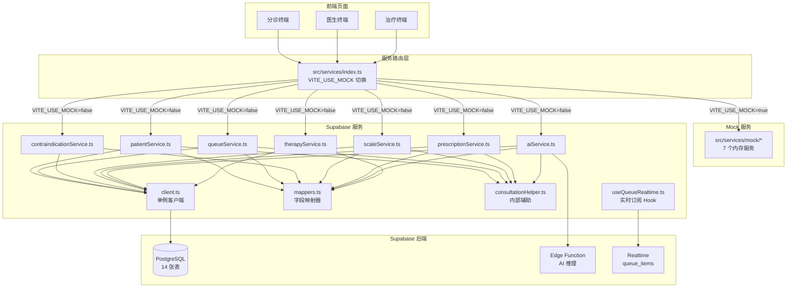
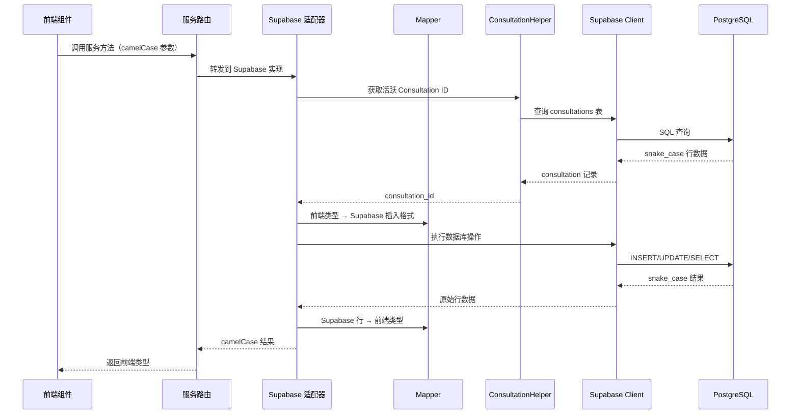
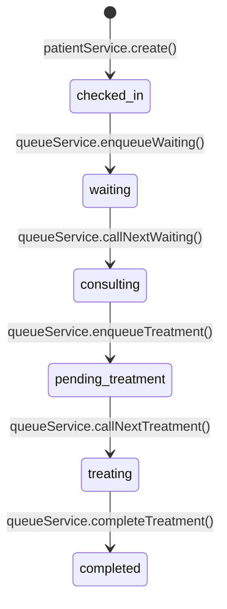
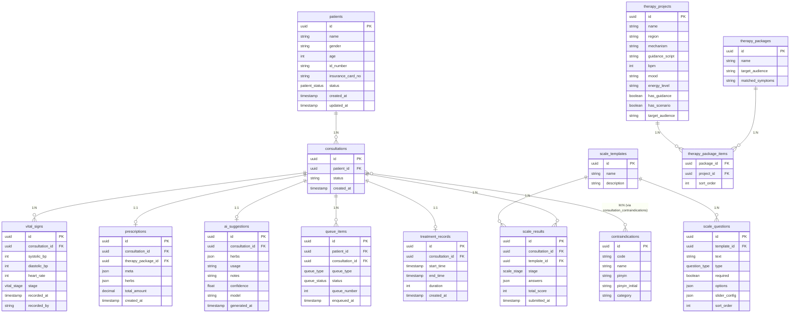

# 设计文档：前后端集成（Mock → Supabase）

## 概述

本设计将"曙光"HIS 系统前端从内存 Mock 服务迁移到 Supabase 后端。核心策略是 **服务适配器模式（Service Adapter Pattern）**：在 `src/services/supabase/` 目录下为每个 Mock 服务创建同接口的 Supabase 实现，通过 `src/services/index.ts` 的环境变量路由实现无缝切换。

关键设计决策：
- **单一 Supabase 客户端**：全局单例，类型化为 `Database`
- **集中式字段映射**：统一处理 snake_case ↔ camelCase 转换
- **Consultation 透明管理**：前端无需感知后端新增的 `consultations` 表，由服务层自动维护生命周期
- **无网关层**：Supabase 直接作为 BaaS，前端通过 JS Client 直连
- **实时订阅**：仅 `queue_items` 表使用 Realtime，通过 React Hook 封装

## 架构

### 整体架构图



### 目录结构

```
src/services/
├── types.ts                    # 前端类型契约（已有，不变）
├── index.ts                    # 服务路由（新建）
├── mock/                       # Mock 服务（已有，不变）
│   ├── index.ts
│   ├── patientService.ts
│   ├── queueService.ts
│   ├── prescriptionService.ts
│   ├── scaleService.ts
│   ├── contraindicationService.ts
│   ├── aiService.ts
│   └── therapyService.ts
└── supabase/                   # Supabase 服务（新建）
    ├── client.ts               # Supabase 客户端单例
    ├── mappers.ts              # 字段映射器
    ├── consultationHelper.ts   # Consultation 生命周期辅助
    ├── errorHelper.ts          # 错误处理辅助
    ├── patientService.ts
    ├── queueService.ts
    ├── prescriptionService.ts
    ├── scaleService.ts
    ├── contraindicationService.ts
    ├── aiService.ts
    ├── therapyService.ts
    └── index.ts                # 统一导出

src/hooks/
└── useQueueRealtime.ts         # 队列实时订阅 Hook
```

### 数据流概览



## 组件与接口

### 1. Supabase 客户端（client.ts）

**职责**：创建并导出类型化的 Supabase 客户端单例。

```typescript
// src/services/supabase/client.ts
import { createClient, SupabaseClient } from "@supabase/supabase-js";
import type { Database } from "@/types/supabase";

const supabaseUrl = import.meta.env.VITE_SUPABASE_URL;
const supabaseAnonKey = import.meta.env.VITE_SUPABASE_ANON_KEY;

if (!supabaseUrl || !supabaseAnonKey) {
  throw new Error(
    "缺少 Supabase 配置：请设置 VITE_SUPABASE_URL 和 VITE_SUPABASE_ANON_KEY 环境变量"
  );
}

export const supabase: SupabaseClient<Database> = createClient<Database>(
  supabaseUrl,
  supabaseAnonKey
);
```

### 2. 错误处理辅助（errorHelper.ts）

**职责**：统一封装 Supabase 错误为结构化 Error。

```typescript
// src/services/supabase/errorHelper.ts
interface SupabaseErrorContext {
  table: string;
  operation: "select" | "insert" | "update" | "delete" | "rpc";
}

export function throwIfError(
  error: { message: string; code?: string } | null,
  context: SupabaseErrorContext
): void {
  if (!error) return;
  throw new Error(
    `[${context.table}.${context.operation}] ${error.message}`
  );
}
```

### 3. Consultation 辅助（consultationHelper.ts）

**职责**：封装 Consultation 生命周期操作，对外部服务透明。

```typescript
// src/services/supabase/consultationHelper.ts
export const consultationHelper = {
  /** 创建新 Consultation */
  create: async (patientId: string): Promise<string> => { /* ... */ },

  /** 获取患者当前活跃 Consultation ID */
  getActiveId: async (patientId: string): Promise<string> => { /* ... */ },

  /** 完成 Consultation */
  complete: async (consultationId: string): Promise<void> => { /* ... */ },
};
```

核心逻辑：
- `create`：向 `consultations` 表插入 `status = 'in-progress'` 的记录，返回 ID
- `getActiveId`：查询 `patient_id = ? AND status = 'in-progress'`，按 `created_at DESC` 取第一条；无结果时抛出 `"该患者没有活跃的诊疗会话"`
- `complete`：将指定 Consultation 的 `status` 更新为 `completed`

### 4. 字段映射器（mappers.ts）

**职责**：双向转换 Supabase 行数据与前端类型。

每个实体类型提供一对映射函数：
- `toXxx(row)` — Supabase 行 → 前端类型
- `fromXxx(data)` — 前端类型 → Supabase 插入格式

```typescript
// src/services/supabase/mappers.ts
import type { Tables, TablesInsert } from "@/types/supabase";
import type {
  Patient, VitalSigns, Contraindication, ScaleTemplate,
  ScaleQuestion, ScaleResult, QueueItem, AISuggestion,
  TherapyProject, TherapyPackage, PrescriptionData,
} from "../types";

// --- Patient ---
export function toPatient(row: Tables<"patients">): Patient { /* ... */ }
export function fromPatientCreate(
  data: Omit<Patient, "id" | "status" | "createdAt">
): TablesInsert<"patients"> { /* ... */ }

// --- VitalSigns ---
export function toVitalSigns(row: Tables<"vital_signs">): VitalSigns { /* ... */ }
export function fromVitalSigns(
  vitals: VitalSigns, consultationId: string, stage: "pre-treatment" | "post-treatment"
): TablesInsert<"vital_signs"> { /* ... */ }

// --- Contraindication ---
export function toContraindication(row: Tables<"contraindications">): Contraindication { /* ... */ }

// --- ScaleTemplate + ScaleQuestion ---
export function toScaleTemplate(
  row: Tables<"scale_templates">,
  questionRows: Tables<"scale_questions">[]
): ScaleTemplate { /* ... */ }

export function toScaleQuestion(row: Tables<"scale_questions">): ScaleQuestion { /* ... */ }

// --- ScaleResult ---
export function toScaleResult(row: Tables<"scale_results">): ScaleResult { /* ... */ }
export function fromScaleResult(
  result: ScaleResult, consultationId: string, stage: "pre" | "post"
): TablesInsert<"scale_results"> { /* ... */ }

// --- QueueItem ---
export function toQueueItem(
  row: Tables<"queue_items"> & { patients: { name: string; insurance_card_no: string | null } }
): QueueItem { /* ... */ }

// --- Prescription ---
export function fromPrescription(
  prescription: PrescriptionData, consultationId: string
): TablesInsert<"prescriptions"> { /* ... */ }

// --- TherapyProject ---
export function toTherapyProject(row: Tables<"therapy_projects">): TherapyProject { /* ... */ }

// --- TherapyPackage ---
export function toTherapyPackage(
  row: Tables<"therapy_packages">,
  projects: TherapyProject[]
): TherapyPackage { /* ... */ }
```


**字段映射对照表（关键实体）**：

| 前端字段 (camelCase) | Supabase 列 (snake_case) | 说明 |
|---|---|---|
| `patient.idNumber` | `patients.id_number` | 身份证号 |
| `patient.insuranceCardNo` | `patients.insurance_card_no` | 医保卡号 |
| `patient.createdAt` | `patients.created_at` | 创建时间 |
| `vitalSigns.systolicBP` | `vital_signs.systolic_bp` | 收缩压 |
| `vitalSigns.diastolicBP` | `vital_signs.diastolic_bp` | 舒张压 |
| `vitalSigns.heartRate` | `vital_signs.heart_rate` | 心率 |
| `vitalSigns.recordedAt` | `vital_signs.recorded_at` | 记录时间 |
| `vitalSigns.recordedBy` | `vital_signs.recorded_by` | 记录人 |
| `contraindication.pinyinInitial` | `contraindications.pinyin_initial` | 拼音首字母 |
| `queueItem.queueNumber` | `queue_items.queue_number` | 排队号 |
| `queueItem.enqueuedAt` | `queue_items.enqueued_at` | 入队时间 |
| `queueItem.patientName` | `patients.name`（JOIN） | 关联查询 |
| `queueItem.insuranceCardNo` | `patients.insurance_card_no`（JOIN） | 关联查询 |
| `scaleQuestion.sliderConfig` | `scale_questions.slider_config` | JSON 字段 |
| `scaleQuestion.sortOrder` | `scale_questions.sort_order` | 排序 |
| `therapyProject.guidanceScript` | `therapy_projects.guidance_script` | 引导语 |
| `therapyProject.hasGuidance` | `therapy_projects.has_guidance` | 是否有引导 |
| `therapyProject.hasScenario` | `therapy_projects.has_scenario` | 是否有场景 |
| `therapyProject.targetAudience` | `therapy_projects.target_audience` | 目标人群 |
| `therapyProject.energyLevel` | `therapy_projects.energy_level` | 能量等级 |
| `prescription.totalAmount` | `prescriptions.total_amount` | 总金额 |
| `prescription.meta` | `prescriptions.meta`（JSON） | 处方元数据 |
| `prescription.herbs` | `prescriptions.herbs`（JSON） | 药材列表 |

### 5. 服务路由（src/services/index.ts）

**职责**：根据 `VITE_USE_MOCK` 环境变量决定导出 Mock 或 Supabase 服务。

```typescript
// src/services/index.ts
const useMock = import.meta.env.VITE_USE_MOCK === "true";

export const {
  patientService,
  queueService,
  prescriptionService,
  scaleService,
  contraindicationService,
  aiService,
  therapyService,
} = useMock
  ? await import("./mock")
  : await import("./supabase");
```

> 使用动态 `import()` 实现 tree-shaking：Mock 模式下不会打包 Supabase 代码，反之亦然。

### 6. 各服务适配器接口

所有 Supabase 服务适配器必须与 Mock 服务保持完全相同的方法签名：

#### patientService

| 方法 | 签名 | 说明 |
|---|---|---|
| `getById` | `(patientId: string) => Promise<Patient \| null>` | 按 ID 查询 |
| `getByInsuranceCard` | `(cardNo: string) => Promise<Patient \| null>` | 按医保卡号查询 |
| `create` | `(data: Omit<Patient, "id" \| "status" \| "createdAt">) => Promise<Patient>` | 创建患者 + 自动创建 Consultation + 状态 `checked-in` |
| `saveVitalSigns` | `(patientId: string, vitals: VitalSigns) => Promise<void>` | 保存生理数据（关联活跃 Consultation，stage=pre-treatment） |
| `getVitalSigns` | `(patientId: string) => Promise<VitalSigns \| null>` | 获取最近一次生理数据 |

#### queueService

| 方法 | 签名 | 说明 |
|---|---|---|
| `getWaitingQueue` | `(departmentId: string) => Promise<QueueItem[]>` | 候诊队列（JOIN patients） |
| `enqueueWaiting` | `(patientId: string, departmentId: string) => Promise<QueueItem>` | 入候诊队列 + 更新患者状态为 `waiting` |
| `callNextWaiting` | `(departmentId: string) => Promise<QueueItem \| null>` | 叫号 + 更新患者状态为 `consulting` |
| `getTreatmentQueue` | `() => Promise<QueueItem[]>` | 治疗队列 |
| `enqueueTreatment` | `(patientId: string) => Promise<QueueItem>` | 入治疗队列 + 更新患者状态为 `pending-treatment` |
| `callNextTreatment` | `() => Promise<QueueItem \| null>` | 治疗叫号 + 更新患者状态为 `treating` |
| `completeTreatment` | `(queueItemId: string) => Promise<void>` | 完成治疗 |

#### contraindicationService

| 方法 | 签名 | 说明 |
|---|---|---|
| `search` | `(keyword: string) => Promise<Contraindication[]>` | 按 name/pinyin/pinyin_initial 模糊搜索 |

#### scaleService

| 方法 | 签名 | 说明 |
|---|---|---|
| `getTemplates` | `() => Promise<ScaleTemplate[]>` | 获取所有模板（不含题目） |
| `getTemplate` | `(templateId: string) => Promise<ScaleTemplate>` | 获取模板详情（含题目，按 sort_order 排序） |
| `saveResult` | `(patientId: string, result: ScaleResult) => Promise<void>` | 保存量表结果（关联活跃 Consultation） |

#### prescriptionService

| 方法 | 签名 | 说明 |
|---|---|---|
| `save` | `(patientId: string, prescription: PrescriptionData) => Promise<void>` | 保存处方（meta/herbs 为 JSON，关联活跃 Consultation） |

#### aiService

| 方法 | 签名 | 说明 |
|---|---|---|
| `getTherapySuggestion` | `(data: { vitals, contraindications, scaleResult }) => Promise<AITherapySuggestion>` | 调用 Edge Function + 写入 ai_suggestions 表 |

#### therapyService

| 方法 | 签名 | 说明 |
|---|---|---|
| `getPackages` | `() => Promise<TherapyPackage[]>` | 获取所有套餐（含关联项目） |
| `getPackageById` | `(id: string) => Promise<TherapyPackage \| null>` | 按 ID 获取套餐 |
| `matchBySymptoms` | `(symptoms: string[]) => Promise<TherapyPackage[]>` | 按症状匹配套餐 |

### 7. 实时订阅 Hook（useQueueRealtime）

**职责**：封装 Supabase Realtime 订阅，提供 React Hook 接口。

```typescript
// src/hooks/useQueueRealtime.ts
import { useEffect, useCallback } from "react";
import { supabase } from "@/services/supabase/client";
import type { QueueItem } from "@/services/types";
import { toQueueItem } from "@/services/supabase/mappers";

type QueueChangeCallback = (payload: {
  eventType: "INSERT" | "UPDATE" | "DELETE";
  new: QueueItem | null;
  old: { id: string } | null;
}) => void;

export function useQueueRealtime(callback: QueueChangeCallback) {
  useEffect(() => {
    const channel = supabase
      .channel("queue-changes")
      .on(
        "postgres_changes",
        { event: "*", schema: "public", table: "queue_items" },
        (payload) => {
          callback({
            eventType: payload.eventType as "INSERT" | "UPDATE" | "DELETE",
            new: payload.new ? toQueueItem(payload.new as any) : null,
            old: payload.old ? { id: (payload.old as any).id } : null,
          });
        }
      )
      .subscribe();

    return () => {
      supabase.removeChannel(channel);
    };
  }, [callback]);
}
```

### 8. 治疗记录服务扩展

治疗记录功能集成在 `queueService` 和 `patientService` 中，不单独创建服务文件：

- **治疗开始**：`callNextTreatment()` 内部同时向 `treatment_records` 插入 `start_time`
- **治疗结束**：`completeTreatment()` 内部更新 `end_time` 和 `duration`
- **治疗后生理数据**：`patientService.saveVitalSigns()` 支持 `stage` 参数（`post-treatment`）
- **治疗后量表**：`scaleService.saveResult()` 支持 `stage` 参数（`post`）
- **完成流程**：`completeTreatment()` 内部同时更新患者状态为 `completed`，Consultation 状态为 `completed`

### 9. 患者状态流转

状态流转由各服务适配器在关键操作中自动触发，前端无需显式调用状态更新：



每次状态变更通过 `supabase.from('patients').update({ status })` 实现，嵌入在对应服务方法内部。

## 数据模型

### Supabase 表与前端类型映射



### 关键数据流转

1. **分诊签到**：`patients` INSERT → `consultations` INSERT → `vital_signs` INSERT → `queue_items` INSERT
2. **医生就诊**：`queue_items` UPDATE → `patients` UPDATE → `consultation_contraindications` INSERT → `scale_results` INSERT → `ai_suggestions` INSERT → `prescriptions` INSERT → `queue_items` INSERT（治疗队列）
3. **治疗执行**：`queue_items` UPDATE → `patients` UPDATE → `treatment_records` INSERT → `vital_signs` INSERT（post） → `scale_results` INSERT（post） → `treatment_records` UPDATE → `consultations` UPDATE
