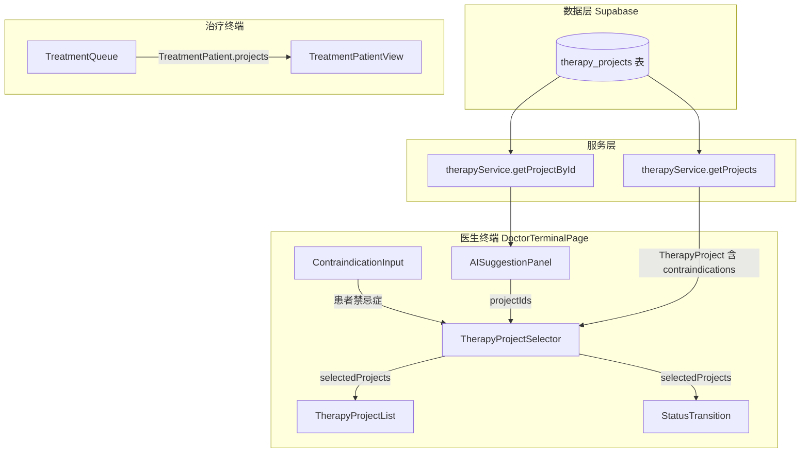
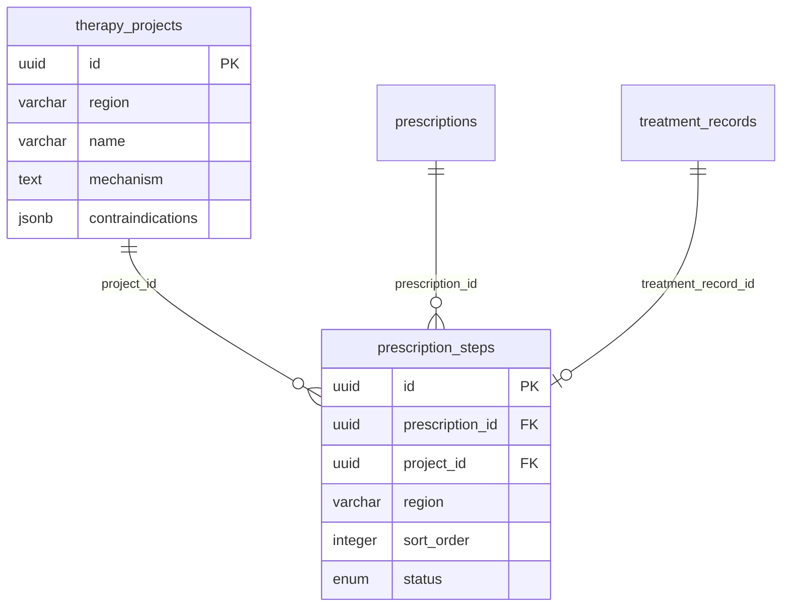

# Design Document: 废弃疗愈套餐，适配项目直选架构

## Overview

后端已完成数据架构重构：废弃 `therapy_packages` / `therapy_package_items` 表，处方通过 `prescription_steps` 表直接关联 `therapy_projects`，实现多房间多步骤流转。本设计覆盖前端全面适配工作，包括类型系统、服务层、组件层、Mock 数据和文档的同步更新。

核心变更方向：
- **套餐 → 项目直选**：医生不再选择预定义套餐，而是直接搜索、多选疗愈项目
- **禁忌症筛选**：每个 `TherapyProject` 携带 `contraindications` JSONB 字段，前端根据患者已录入禁忌症自动过滤冲突项目
- **AI 建议适配**：`AITherapySuggestion` 从推荐单个套餐改为推荐多个项目 ID

影响范围：约 15 个文件，涉及类型定义、Supabase 服务、Mock 服务/数据、医生终端 4 个组件、治疗终端 2 个组件、Preview 配置 2 个、验证脚本 1 个、文档 1 个。

## Architecture

整体架构不变（React SPA + Supabase 后端），变更集中在数据流路径上：



### 设计决策

1. **多选模式而非单选**：套餐是预组合的固定项目集，废弃后医生需要自由组合，因此 `TherapyProjectSelector` 采用多选模式，`selectedProjects: TherapyProject[]` 替代 `selectedPackage: TherapyPackage | null`。

2. **禁忌症前端过滤**：`therapy_projects.contraindications` 是 JSONB `string[]`，前端在组件层做字符串匹配过滤（患者禁忌症 name vs 项目 contraindications 数组），无需额外后端接口。

3. **AI 建议返回项目 ID 列表**：`AITherapySuggestion` 改为 `projectIds: string[]` + `projectNames: string[]`，医生采纳后批量调用 `getProjectById` 填充 `selectedProjects`。

4. **Mock 数据从套餐拍平为项目列表**：原 `mockTherapyPackages` 中的项目数据提取为独立的 `mockTherapyProjects`，每个项目补充 `contraindications` 字段。

## Components and Interfaces

### 类型变更（`src/services/types.ts`）

```typescript
// 删除
interface TherapyPackage { ... }

// 修改
interface TherapyProject {
  // ... 现有字段不变
  contraindications: string[];  // 新增：项目级禁忌症名称列表
}

interface TreatmentPatient extends Patient {
  vitalSigns: VitalSigns;
  contraindications: Contraindication[];
  projects: TherapyProject[];  // 替代 therapyPackage: TherapyPackage
}

interface AITherapySuggestion {
  id: string;
  projectIds: string[];      // 替代 packageId
  projectNames: string[];    // 替代 packageName
  reason: string;
  confidence: number;
  generatedAt: string;
}
```

### 服务层接口变更（`therapyService`）

```typescript
// 旧接口（删除）
getPackages(): Promise<TherapyPackage[]>
getPackageById(id: string): Promise<TherapyPackage | null>
matchBySymptoms(symptoms: string[]): Promise<TherapyPackage[]>

// 新接口
getProjects(): Promise<TherapyProject[]>
getProjectById(id: string): Promise<TherapyProject | null>
matchBySymptoms(symptoms: string[]): Promise<TherapyProject[]>
```

### Mapper 变更（`src/services/supabase/mappers.ts`）

```typescript
// 删除
export function toTherapyPackage(...): TherapyPackage { ... }

// 修改 toTherapyProject：新增 contraindications 映射
export function toTherapyProject(row: Tables<"therapy_projects">): TherapyProject {
  return {
    // ... 现有字段映射不变
    contraindications: Array.isArray(row.contraindications)
      ? (row.contraindications as string[])
      : [],
  };
}
```

### 组件接口变更

| 组件 | 旧 Props | 新 Props |
|------|----------|----------|
| `TherapyProjectSelector`（新） | `selectedPackageId, onSelect(pkg)` | `selectedProjects: TherapyProject[], patientContraindications: Contraindication[], onSelect(projects: TherapyProject[])` |
| `TherapyProjectList` | `selectedPackage: TherapyPackage \| null` | `selectedProjects: TherapyProject[]` |
| `StatusTransition` | `selectedPackage: TherapyPackage \| null` | `selectedProjects: TherapyProject[]` |
| `TreatmentPatientView` | `patient.therapyPackage` | `patient.projects` |
| `DoctorTerminalPage` | `selectedPackage` state | `selectedProjects` state |
| `AISuggestionPanel` | `onAdopt(suggestion)` → 读 `packageId` | `onAdopt(suggestion)` → 读 `projectIds` |


## Data Models

### 数据库表变更（已完成，前端需适配）

#### 已删除的表
- `therapy_packages`：疗愈套餐主表
- `therapy_package_items`：套餐-项目关联表

#### 已修改的表

**therapy_projects** — 新增字段：
| 字段 | 类型 | 说明 |
|------|------|------|
| `contraindications` | `JSONB DEFAULT '[]'` | 项目级禁忌症列表，如 `["癫痫患者","严重心律失常"]` |

**treatment_records** — 变更：
| 字段 | 类型 | 说明 |
|------|------|------|
| `region` | `VARCHAR(50)` | 新增：治疗区域 |
| `consultation_id` | — | 从 UNIQUE 约束改为普通索引（支持 1:N） |

**queue_items** — 新增字段：
| 字段 | 类型 | 说明 |
|------|------|------|
| `region` | `VARCHAR(50)` | 队列项所属区域 |

#### 新增的表

**prescription_steps** — 处方执行步骤：
| 字段 | 类型 | 说明 |
|------|------|------|
| `id` | `UUID PK` | 主键 |
| `prescription_id` | `UUID FK → prescriptions` | 所属处方 |
| `project_id` | `UUID FK → therapy_projects` | 关联疗愈项目 |
| `region` | `VARCHAR(50) NOT NULL` | 执行区域 |
| `sort_order` | `INTEGER DEFAULT 0` | 步骤顺序 |
| `status` | `prescription_step_status ENUM` | pending / in-progress / completed / skipped |
| `started_at` | `TIMESTAMPTZ` | 开始时间 |
| `completed_at` | `TIMESTAMPTZ` | 完成时间 |
| `treatment_record_id` | `UUID FK → treatment_records` | 关联治疗记录 |

**system_config** — 系统配置：
| 字段 | 类型 | 说明 |
|------|------|------|
| `id` | `UUID PK` | 主键 |
| `key` | `VARCHAR(100) UNIQUE` | 配置键 |
| `value` | `TEXT` | 配置值 |
| `description` | `TEXT` | 描述 |
| `updated_at` | `TIMESTAMPTZ` | 更新时间 |

**prescriptions** — 已删除字段：
| 字段 | 说明 |
|------|------|
| `therapy_package_id` | 已删除，处方不再关联套餐 |

### 前端类型到数据库的映射关系



### Mock 数据结构变更

**删除**：`src/services/mock/data/therapyPackages.ts`

**新建**：`src/services/mock/data/therapyProjects.ts`
- 从原 `mockTherapyPackages` 中提取去重的项目列表
- 每个项目补充 `contraindications: string[]` 字段
- 覆盖三个区域：睡眠区（~13 项）、情志区（~10 项）、运动疗愈区（3 项）

**更新**：`src/services/mock/data/contraindications.ts`
- 从原 18 条中医禁忌症改为与后端 seed 一致的 13 条（7 项目级 + 4 全局通用 + 2 睡眠区通用）
- 保持 `Contraindication` 接口不变（code, name, pinyin, pinyinInitial, category）


## Correctness Properties

*A property is a characteristic or behavior that should hold true across all valid executions of a system—essentially, a formal statement about what the system should do. Properties serve as the bridge between human-readable specifications and machine-verifiable correctness guarantees.*

### Property 1: toTherapyProject 正确映射 contraindications

*For any* valid `therapy_projects` 数据库行，其 `contraindications` JSONB 字段为字符串数组或 null/undefined 时，`toTherapyProject` 函数应返回一个 `TherapyProject` 对象，其 `contraindications` 字段为 `string[]` 类型（JSONB 为 null 时返回空数组）。

**Validates: Requirements 2.5, 3.2**

### Property 2: getProjectById 查询一致性

*For any* 存在于 `mockTherapyProjects` 中的项目 ID，调用 `getProjectById(id)` 应返回一个 `TherapyProject` 对象，且其 `id` 字段等于传入的 ID；对于不存在的 ID，应返回 `null`。

**Validates: Requirements 2.2**

### Property 3: matchBySymptoms 返回相关项目

*For any* 非空症状关键词数组和项目列表，`matchBySymptoms` 返回的每个项目的 `targetAudience` 字段应至少包含输入关键词之一（ilike 匹配）。

**Validates: Requirements 2.3**

### Property 4: 关键词过滤正确性

*For any* 关键词字符串和项目列表，`TherapyProjectSelector` 的过滤逻辑返回的每个项目应满足：其 `name`、`region`、`targetAudience` 或 `mood` 字段中至少有一个包含该关键词（不区分大小写）。

**Validates: Requirements 5.2**

### Property 5: 项目选择添加/移除往返一致性

*For any* 已选项目列表和一个不在列表中的项目，将该项目添加到列表后再移除，应得到与原始列表相同的结果（round-trip）。

**Validates: Requirements 5.3, 5.4**

### Property 6: 禁忌症过滤正确性

*For any* 患者禁忌症列表和项目列表，被标记为禁用的项目集合应恰好等于：其 `contraindications` 数组与患者禁忌症名称集合存在交集的项目集合。且每个禁用项目应显示具体匹配的禁忌症名称。

**Validates: Requirements 5.5, 12.2, 12.3**

### Property 7: AI 建议采纳填充 selectedProjects

*For any* `AITherapySuggestion`（含 N 个 `projectIds`），医生采纳后 `selectedProjects` 应包含恰好 N 个项目，且每个项目的 `id` 都在 `projectIds` 中。

**Validates: Requirements 6.2**

### Property 8: 空选择阻止流转

*For any* `selectedProjects` 为空数组的状态，「确认处方并流转」按钮应不可点击或不可见。

**Validates: Requirements 6.3**

### Property 9: 渲染项目信息完整性

*For any* 非空 `TherapyProject[]` 列表，渲染输出应包含每个项目的名称和 region 标签；在 `StatusTransition` 中还应显示项目总数。

**Validates: Requirements 7.3, 8.2, 9.2**

### Property 10: 禁忌症搜索兼容性

*For any* 搜索关键词，`contraindicationService.search` 返回的每个结果的 `name`、`pinyin` 或 `pinyinInitial` 应包含该关键词（不区分大小写）。

**Validates: Requirements 12.1**

## Error Handling

### 服务层错误处理

| 场景 | 处理方式 |
|------|----------|
| `getProjects()` 查询失败 | `throwIfError` 抛出，上层组件 catch 后显示错误提示 |
| `getProjectById(id)` 查询不存在的 ID | 返回 `null`，调用方需判空 |
| `matchBySymptoms([])` 空数组输入 | 直接返回 `[]`，不发起查询 |
| `contraindications` JSONB 字段格式异常 | `toTherapyProject` 中 `Array.isArray` 检查，非数组时回退为 `[]` |
| AI 建议中的 `projectIds` 包含无效 ID | `getProjectById` 返回 `null`，过滤掉无效项，仅填充有效项目 |

### 组件层错误处理

| 场景 | 处理方式 |
|------|----------|
| `TherapyProjectSelector` 加载项目列表失败 | 显示错误提示，允许重试 |
| `selectedProjects` 为空时点击流转 | 按钮禁用，不触发流转 |
| 患者无禁忌症时的过滤逻辑 | 空禁忌症列表 → 不过滤任何项目，所有项目可选 |
| Mock 模式下数据不一致 | Mock 服务与 Supabase 服务保持相同接口签名，确保切换无感 |

## Testing Strategy

### 单元测试

针对具体示例和边界情况：

- **类型检查**：验证 `TherapyPackage` 类型不存在于 `types.ts` 导出中
- **Mapper 边界**：`toTherapyProject` 处理 `contraindications` 为 `null`、`undefined`、空数组、正常数组的情况
- **空输入**：`matchBySymptoms([])` 返回空数组
- **Mock 数据完整性**：`mockTherapyProjects` 覆盖三个区域，`mockContraindications` 恰好 13 条
- **组件渲染**：`TherapyProjectList` 在 `selectedProjects=[]` 时显示占位提示
- **代码清理验证**：相关文件中不包含 `TherapyPackage`、`therapy_packages`、`toTherapyPackage` 等已废弃引用

### 属性测试（Property-Based Testing）

使用 `fast-check` 库，每个属性测试最少运行 100 次迭代。

每个测试必须以注释标注对应的设计属性：

```typescript
// Feature: therapy-package-deprecation, Property 1: toTherapyProject 正确映射 contraindications
```

属性测试覆盖：

1. **Property 1**：生成随机 `therapy_projects` 行数据（contraindications 为随机字符串数组或 null），验证 `toTherapyProject` 输出的 `contraindications` 始终为 `string[]`
2. **Property 2**：从 mock 项目列表中随机选取 ID，验证 `getProjectById` 返回匹配项目；生成随机 UUID 验证返回 `null`
3. **Property 3**：生成随机症状关键词，验证 `matchBySymptoms` 返回的每个项目的 `targetAudience` 包含至少一个关键词
4. **Property 4**：生成随机关键词和项目列表，验证过滤结果的正确性
5. **Property 5**：生成随机项目列表和一个不在列表中的项目，验证添加后移除的往返一致性
6. **Property 6**：生成随机患者禁忌症和项目列表（含随机 contraindications），验证禁用集合的正确性
7. **Property 7**：生成随机 projectIds 子集，验证采纳后 selectedProjects 的一致性
8. **Property 8**：验证空 selectedProjects 时流转按钮状态
9. **Property 9**：生成随机项目列表，验证渲染输出包含所有项目名称和 region
10. **Property 10**：生成随机关键词，验证搜索结果的字段匹配正确性

### 测试配置

```typescript
// vitest.config.ts 中确保 fast-check 可用
// 每个属性测试：
fc.assert(
  fc.property(/* arbitraries */, (input) => {
    // property assertion
  }),
  { numRuns: 100 }
);
```

