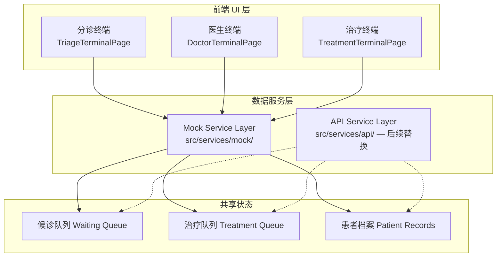
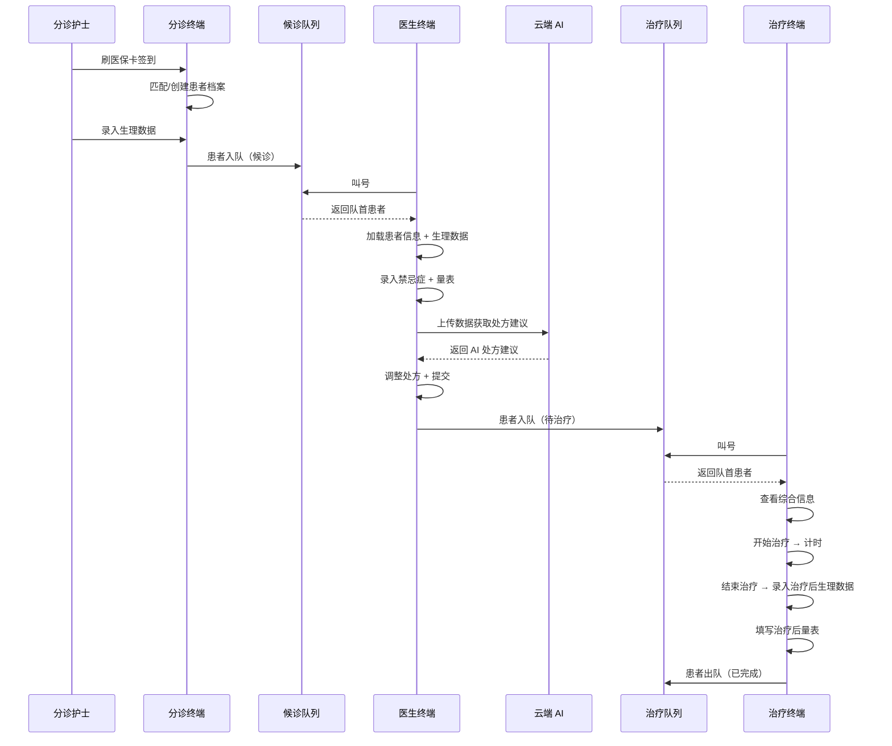

# 设计文档：分诊-诊疗-治疗全流程系统

## 概述

本设计文档描述中医门诊「分诊→诊疗→治疗」三终端协作系统的技术架构与实现方案。系统包含三个独立页面终端（分诊终端、医生终端、治疗终端），通过队列机制串联，实现患者从签到到治疗完成的全流程闭环。

### 设计原则

1. **前后端分离**：前端 UI 层与后端 API/数据层完全解耦，通过 Mock 数据层抽象接口
2. **UI 优先开发**：先构建页面和 Block 组件（使用 Mock 数据），后接入真实 API
3. **积木式架构**：每个页面按功能区域拆分为独立 Block 组件，通过 props/context 通信
4. **复用已有组件**：最大化复用 `PrescriptionForm`、`HerbGrid`、`ActionBar`、`PatientInfoCard`、`MaskedText` 等已有组件

### 技术栈

- React 18 + TypeScript + Vite
- Tailwind CSS + shadcn/ui（HIS 紧凑模式）
- @tanstack/react-table + @tanstack/react-virtual
- react-hook-form + zod（表单校验）
- lucide-react（图标）


## 架构

### 整体架构

系统采用前后端分离架构，前端通过 Mock 数据服务层（`mockService`）模拟后端 API，后续可无缝替换为真实 API 调用。



### 三终端流程串联



### 目录结构

```
src/
├── services/                          # 数据服务层
│   ├── types.ts                       # 共享类型定义
│   ├── mock/                          # Mock 数据服务
│   │   ├── index.ts                   # Mock 服务统一导出
│   │   ├── patientService.ts          # 患者档案 Mock
│   │   ├── queueService.ts            # 队列管理 Mock
│   │   ├── prescriptionService.ts     # 处方相关 Mock
│   │   ├── scaleService.ts            # 量表模板 Mock
│   │   ├── contraindicationService.ts # 禁忌症字典 Mock
│   │   ├── aiService.ts              # AI 建议 Mock
│   │   └── data/                      # Mock 静态数据
│   │       ├── patients.ts
│   │       ├── contraindications.ts
│   │       └── scaleTemplates.ts
│   └── api/                           # 真实 API 服务（后续实现）
│       └── index.ts
├── pages/
│   ├── triage-terminal/               # 分诊终端
│   │   ├── TriageTerminalPage.tsx     # 页面入口
│   │   └── blocks/
│   │       ├── PatientCheckIn.tsx     # 刷卡签到
│   │       ├── VitalSignsInput.tsx    # 生理数据录入
│   │       └── QueueAssignment.tsx    # 队列分配确认
│   ├── doctor-terminal/               # 医生终端
│   │   ├── DoctorTerminalPage.tsx     # 页面入口
│   │   └── blocks/
│   │       ├── CallQueue.tsx          # 叫号面板
│   │       ├── PatientInfoBar.tsx     # 患者信息条（扩展已有）
│   │       ├── ContraindicationInput.tsx # 禁忌症录入
│   │       ├── ScaleForm.tsx          # 量表采集
│   │       ├── AISuggestionPanel.tsx  # AI 建议面板
│   │       └── StatusTransition.tsx   # 状态流转确认
│   └── treatment-terminal/            # 治疗终端
│       ├── TreatmentTerminalPage.tsx  # 页面入口
│       └── blocks/
│           ├── TreatmentQueue.tsx     # 治疗叫号面板
│           ├── TreatmentPatientView.tsx # 综合信息视图
│           ├── TreatmentAction.tsx    # 治疗执行操作
│           ├── PostVitalSigns.tsx     # 治疗后生理数据
│           ├── PostScaleForm.tsx      # 治疗后量表
│           └── QueueComplete.tsx      # 出队确认
└── components/his/                    # 共享 HIS 组件
    ├── MaskedText.tsx                 # 已有 — 脱敏组件
    └── PatientInfoCard.tsx            # 已有 — 患者信息卡片
```

### 前后端分离策略：Mock 数据服务层

所有 Block 组件通过 `services/` 层获取数据，不直接依赖后端 API。Mock 服务层提供与真实 API 相同的接口签名，开发阶段使用内存数据，后续通过替换 `import` 路径切换到真实 API。

```typescript
// services/mock/index.ts — 统一导出
export { patientService } from './patientService';
export { queueService } from './queueService';
export { prescriptionService } from './prescriptionService';
export { scaleService } from './scaleService';
export { contraindicationService } from './contraindicationService';
export { aiService } from './aiService';
```

页面入口组件通过 service 获取数据，再通过 props 注入到各 Block：

```typescript
// 页面入口示例
const patient = await patientService.getByInsuranceCard(cardNo);
const queue = await queueService.getWaitingQueue(departmentId);
// 通过 props 传递给 Block
<CallQueue items={queue} onCallNext={handleCallNext} />
```


## 组件与接口

### 分诊终端（TriageTerminalPage）

#### 页面入口组件

```tsx
// pages/triage-terminal/TriageTerminalPage.tsx
export function TriageTerminalPage() {
  // 步骤状态：checkin → vitals → queue
  const [step, setStep] = useState<"checkin" | "vitals" | "queue">("checkin");
  const [patient, setPatient] = useState<Patient | null>(null);
  const [vitalSigns, setVitalSigns] = useState<VitalSigns | null>(null);

  return (
    <div className="flex flex-col h-screen bg-neutral-50">
      <Card className="rounded-lg shadow-sm">
        <CardContent className="p-3 flex flex-col gap-2">
          {step === "checkin" && (
            <PatientCheckIn onCheckInComplete={(p) => { setPatient(p); setStep("vitals"); }} />
          )}
          {step === "vitals" && patient && (
            <VitalSignsInput patient={patient} onSave={(v) => { setVitalSigns(v); setStep("queue"); }} />
          )}
          {step === "queue" && patient && vitalSigns && (
            <QueueAssignment patient={patient} vitalSigns={vitalSigns} onComplete={() => setStep("checkin")} />
          )}
        </CardContent>
      </Card>
    </div>
  );
}
```

#### Block 组件接口

| Block | Props | 职责 |
|-------|-------|------|
| `PatientCheckIn` | `onCheckInComplete: (patient: Patient) => void` | 刷卡签到、档案匹配/创建、手动输入备选 |
| `VitalSignsInput` | `patient: Patient; onSave: (vitals: VitalSigns) => void` | 血压心率录入、范围校验、异常高亮 |
| `QueueAssignment` | `patient: Patient; vitalSigns: VitalSigns; onComplete: () => void` | 队列分配确认、排队序号展示 |

#### 数据流

```
PatientCheckIn ──(patient)──→ 页面入口
页面入口 ──(patient)──→ VitalSignsInput
VitalSignsInput ──(vitalSigns)──→ 页面入口
页面入口 ──(patient, vitalSigns)──→ QueueAssignment
```

### 医生终端（DoctorTerminalPage）

#### 页面入口组件

```tsx
// pages/doctor-terminal/DoctorTerminalPage.tsx
export function DoctorTerminalPage() {
  const [currentPatient, setCurrentPatient] = useState<Patient | null>(null);
  const [consultationData, setConsultationData] = useState<ConsultationData>({
    contraindications: [],
    scaleResults: null,
    aiSuggestion: null,
  });

  return (
    <div className="flex flex-col h-screen bg-neutral-50 gap-1 p-2">
      {/* 左侧叫号面板 + 右侧诊疗区域 的布局 */}
      <div className="flex gap-2 flex-1 min-h-0">
        {/* 左侧：叫号队列 */}
        <div className="w-64 shrink-0">
          <CallQueue onPatientCalled={setCurrentPatient} disabled={!!currentPatient} />
        </div>
        {/* 右侧：诊疗工作区 */}
        <div className="flex-1 flex flex-col gap-1 overflow-auto">
          {currentPatient && (
            <>
              <PatientInfoBar patient={currentPatient} />
              <ContraindicationInput
                value={consultationData.contraindications}
                onChange={(c) => setConsultationData(prev => ({ ...prev, contraindications: c }))}
              />
              <ScaleForm onSubmit={(r) => setConsultationData(prev => ({ ...prev, scaleResults: r }))} />
              <AISuggestionPanel
                patient={currentPatient}
                consultationData={consultationData}
                onAdopt={(suggestion) => { /* 预填处方 */ }}
              />
              <PrescriptionForm />
              <HerbGrid />
              <ActionBar onAction={handleAction} />
              <StatusTransition
                patient={currentPatient}
                onComplete={() => { setCurrentPatient(null); }}
              />
            </>
          )}
        </div>
      </div>
    </div>
  );
}
```

#### Block 组件接口

| Block | Props | 职责 |
|-------|-------|------|
| `CallQueue` | `onPatientCalled: (patient: Patient) => void; disabled: boolean` | 候诊列表展示、叫号操作、空状态 |
| `PatientInfoBar` | `patient: Patient` | 患者基本信息 + 生理数据展示（扩展已有组件） |
| `ContraindicationInput` | `value: Contraindication[]; onChange: (items: Contraindication[]) => void` | 禁忌症字典检索、选择、已选列表管理 |
| `ScaleForm` | `onSubmit: (results: ScaleResult) => void` | 量表模板选择、动态题目渲染、必填校验 |
| `AISuggestionPanel` | `patient: Patient; consultationData: ConsultationData; onAdopt: (suggestion: AISuggestion) => void` | AI 建议请求、加载态、结果展示、采纳操作 |
| `PrescriptionForm` | `onFormChange?: (values: PrescriptionMeta) => void`（已有） | 处方元数据表单 |
| `HerbGrid` | `herbs?: HerbItem[]; onHerbChange?: ...`（已有） | 中药处方明细网格 |
| `ActionBar` | `onAction?: (action: string) => void`（已有） | 审核、上传等操作按钮 |
| `StatusTransition` | `patient: Patient; onComplete: () => void` | 状态流转确认、治疗队列分配 |

#### 数据流

```
CallQueue ──(patient)──→ 页面入口
页面入口 ──(patient)──→ PatientInfoBar, AISuggestionPanel, StatusTransition
ContraindicationInput ──(contraindications)──→ 页面入口
ScaleForm ──(scaleResults)──→ 页面入口
页面入口 ──(consultationData)──→ AISuggestionPanel
AISuggestionPanel ──(suggestion)──→ 页面入口 → PrescriptionForm + HerbGrid（预填）
ActionBar ──(action)──→ 页面入口（处方提交触发 StatusTransition）
StatusTransition ──(complete)──→ 页面入口（重置状态，重新启用叫号）
```

### 治疗终端（TreatmentTerminalPage）

#### 页面入口组件

```tsx
// pages/treatment-terminal/TreatmentTerminalPage.tsx
export function TreatmentTerminalPage() {
  const [currentPatient, setCurrentPatient] = useState<TreatmentPatient | null>(null);
  const [treatmentState, setTreatmentState] = useState<TreatmentState>({
    status: "idle", // idle → treating → post-vitals → post-scale → completing
    startTime: null,
    endTime: null,
  });

  return (
    <div className="flex flex-col h-screen bg-neutral-50 gap-1 p-2">
      <div className="flex gap-2 flex-1 min-h-0">
        <div className="w-64 shrink-0">
          <TreatmentQueue onPatientCalled={setCurrentPatient} disabled={!!currentPatient} />
        </div>
        <div className="flex-1 flex flex-col gap-1 overflow-auto">
          {currentPatient && (
            <>
              <TreatmentPatientView patient={currentPatient} />
              <TreatmentAction
                state={treatmentState}
                onStart={() => setTreatmentState({ ...treatmentState, status: "treating", startTime: new Date() })}
                onEnd={() => setTreatmentState({ ...treatmentState, status: "post-vitals", endTime: new Date() })}
              />
              {treatmentState.status === "post-vitals" && (
                <PostVitalSigns
                  preVitals={currentPatient.vitalSigns}
                  onSave={() => setTreatmentState(prev => ({ ...prev, status: "post-scale" }))}
                />
              )}
              {treatmentState.status === "post-scale" && (
                <PostScaleForm onSubmit={() => setTreatmentState(prev => ({ ...prev, status: "completing" }))} />
              )}
              {treatmentState.status === "completing" && (
                <QueueComplete
                  patient={currentPatient}
                  treatmentState={treatmentState}
                  onComplete={() => { setCurrentPatient(null); setTreatmentState({ status: "idle", startTime: null, endTime: null }); }}
                />
              )}
            </>
          )}
        </div>
      </div>
    </div>
  );
}
```

#### Block 组件接口

| Block | Props | 职责 |
|-------|-------|------|
| `TreatmentQueue` | `onPatientCalled: (patient: TreatmentPatient) => void; disabled: boolean` | 治疗队列展示、叫号、空状态 |
| `TreatmentPatientView` | `patient: TreatmentPatient` | 综合信息分区展示（基本信息、生理、禁忌症、处方） |
| `TreatmentAction` | `state: TreatmentState; onStart: () => void; onEnd: () => void` | 开始/结束治疗按钮、计时器 |
| `PostVitalSigns` | `preVitals: VitalSigns; onSave: (postVitals: VitalSigns) => void` | 治疗后生理数据录入、前后对比、变化幅度警告 |
| `PostScaleForm` | `onSubmit: (results: ScaleResult) => void` | 治疗后量表评估 |
| `QueueComplete` | `patient: TreatmentPatient; treatmentState: TreatmentState; onComplete: () => void` | 出队确认、治疗摘要展示 |

#### 数据流

```
TreatmentQueue ──(patient)──→ 页面入口
页面入口 ──(patient)──→ TreatmentPatientView, QueueComplete
TreatmentAction ──(start/end)──→ 页面入口（更新 treatmentState）
PostVitalSigns ──(postVitals)──→ 页面入口
PostScaleForm ──(scaleResults)──→ 页面入口
QueueComplete ──(complete)──→ 页面入口（重置状态，重新启用叫号）
```


## 数据模型

### 核心类型定义

```typescript
// services/types.ts

/** 患者基本信息 */
export interface Patient {
  id: string;
  name: string;
  gender: "male" | "female";
  age: number;
  idNumber: string;
  phone: string;
  insuranceCardNo: string;
  status: PatientStatus;
  createdAt: string;
}

/** 患者流程状态 */
export type PatientStatus =
  | "checked-in"     // 已签到
  | "waiting"        // 候诊中
  | "consulting"     // 就诊中
  | "pending-treatment" // 待治疗
  | "treating"       // 治疗中
  | "completed";     // 已完成

/** 生理数据 */
export interface VitalSigns {
  systolicBP: number;   // 收缩压 40-300 mmHg
  diastolicBP: number;  // 舒张压 20-200 mmHg
  heartRate: number;    // 心率 20-300 次/分
  recordedAt: string;
  recordedBy: string;
}

/** 生理数据校验规则 */
export const VITAL_SIGNS_RULES = {
  systolicBP: { min: 40, max: 300, unit: "mmHg", label: "收缩压" },
  diastolicBP: { min: 20, max: 200, unit: "mmHg", label: "舒张压" },
  heartRate: { min: 20, max: 300, unit: "次/分", label: "心率" },
} as const;

/** 生理数据异常阈值 */
export const VITAL_SIGNS_ALERT_THRESHOLDS = {
  systolicBP: 180,
  diastolicBP: 120,
  heartRate: 150,
} as const;

/** 禁忌症条目 */
export interface Contraindication {
  code: string;
  name: string;
  pinyin: string;       // 拼音全拼
  pinyinInitial: string; // 拼音首字母
  category: string;
}

/** 量表模板 */
export interface ScaleTemplate {
  id: string;
  name: string;
  description: string;
  questions: ScaleQuestion[];
}

/** 量表题目 */
export interface ScaleQuestion {
  id: string;
  text: string;
  type: "single-choice" | "multi-choice" | "slider" | "text";
  required: boolean;
  options?: ScaleOption[];    // 单选/多选的选项
  sliderConfig?: { min: number; max: number; step: number }; // 滑块配置
}

/** 量表选项 */
export interface ScaleOption {
  value: string;
  label: string;
  score?: number;
}

/** 量表填写结果 */
export interface ScaleResult {
  templateId: string;
  answers: Record<string, string | string[] | number>;
  totalScore?: number;
  submittedAt: string;
}

/** AI 处方建议 */
export interface AISuggestion {
  id: string;
  herbs: AISuggestedHerb[];
  usage: string;
  notes: string;
  confidence: number;
  generatedAt: string;
}

/** AI 建议药材 */
export interface AISuggestedHerb {
  name: string;
  dosage: number;
  unit: string;
  reason: string;
}

/** 候诊/治疗队列项 */
export interface QueueItem {
  id: string;
  patientId: string;
  patientName: string;
  queueNumber: number;
  status: "waiting" | "in-progress" | "completed";
  enqueuedAt: string;
  prescriptionType?: string; // 治疗队列专用
}

/** 治疗记录 */
export interface TreatmentRecord {
  patientId: string;
  startTime: string | null;
  endTime: string | null;
  duration: number | null;  // 秒
  preVitals: VitalSigns;
  postVitals: VitalSigns | null;
  postScaleResult: ScaleResult | null;
}

/** 诊疗数据（医生终端汇总） */
export interface ConsultationData {
  contraindications: Contraindication[];
  scaleResults: ScaleResult | null;
  aiSuggestion: AISuggestion | null;
}

/** 治疗终端患者（含完整诊疗信息） */
export interface TreatmentPatient extends Patient {
  vitalSigns: VitalSigns;
  contraindications: Contraindication[];
  prescription: PrescriptionData;
}

/** 处方数据 */
export interface PrescriptionData {
  meta: PrescriptionMeta;
  herbs: HerbItem[];
  totalAmount: number;
}

/** 治疗状态 */
export interface TreatmentState {
  status: "idle" | "treating" | "post-vitals" | "post-scale" | "completing";
  startTime: Date | null;
  endTime: Date | null;
}
```

### Mock 数据服务接口

```typescript
// services/mock/patientService.ts
export const patientService = {
  /** 通过医保卡号查询患者 */
  getByInsuranceCard: async (cardNo: string): Promise<Patient | null> => { ... },
  /** 创建新患者档案 */
  create: async (data: Omit<Patient, "id" | "status" | "createdAt">): Promise<Patient> => { ... },
  /** 保存生理数据 */
  saveVitalSigns: async (patientId: string, vitals: VitalSigns): Promise<void> => { ... },
};

// services/mock/queueService.ts
export const queueService = {
  /** 获取候诊队列 */
  getWaitingQueue: async (departmentId: string): Promise<QueueItem[]> => { ... },
  /** 患者入队（候诊） */
  enqueueWaiting: async (patientId: string, departmentId: string): Promise<QueueItem> => { ... },
  /** 叫号（候诊） */
  callNextWaiting: async (departmentId: string): Promise<QueueItem | null> => { ... },
  /** 获取治疗队列 */
  getTreatmentQueue: async (): Promise<QueueItem[]> => { ... },
  /** 患者入队（治疗） */
  enqueueTreatment: async (patientId: string): Promise<QueueItem> => { ... },
  /** 叫号（治疗） */
  callNextTreatment: async (): Promise<QueueItem | null> => { ... },
  /** 患者出队（治疗完成） */
  completeTreatment: async (queueItemId: string): Promise<void> => { ... },
  /** 获取队列最大容量 */
  getMaxQueueSize: async (departmentId: string): Promise<number> => { ... },
};

// services/mock/contraindicationService.ts
export const contraindicationService = {
  /** 搜索禁忌症（支持拼音首字母和汉字模糊匹配） */
  search: async (keyword: string): Promise<Contraindication[]> => { ... },
};

// services/mock/scaleService.ts
export const scaleService = {
  /** 获取量表模板列表 */
  getTemplates: async (): Promise<ScaleTemplate[]> => { ... },
  /** 获取量表模板详情 */
  getTemplate: async (templateId: string): Promise<ScaleTemplate> => { ... },
  /** 保存量表结果 */
  saveResult: async (patientId: string, result: ScaleResult): Promise<void> => { ... },
};

// services/mock/aiService.ts
export const aiService = {
  /** 获取 AI 处方建议 */
  getSuggestion: async (data: {
    vitals: VitalSigns;
    contraindications: Contraindication[];
    scaleResult: ScaleResult | null;
  }): Promise<AISuggestion> => { ... },
};

// services/mock/prescriptionService.ts
export const prescriptionService = {
  /** 保存处方 */
  save: async (patientId: string, prescription: PrescriptionData): Promise<void> => { ... },
};
```

### 生理数据校验逻辑

生理数据校验为分诊终端和治疗终端共享的核心逻辑，抽取为独立工具函数：

```typescript
// lib/vitalSignsValidation.ts

export interface VitalSignsValidationResult {
  valid: boolean;
  errors: Record<string, string>;
  alerts: Record<string, boolean>;
}

/** 校验生理数据范围 */
export function validateVitalSigns(vitals: Partial<VitalSigns>): VitalSignsValidationResult { ... }

/** 判断生理数据是否存在异常值 */
export function hasVitalSignsAlert(vitals: VitalSigns): boolean { ... }

/** 计算治疗前后生理数据变化百分比 */
export function calculateVitalSignsChange(pre: VitalSigns, post: VitalSigns): Record<string, number> { ... }
```


## 后端规划（预规划，本次 Spec 不实现）

### 技术选型：Supabase（自托管）

选择 Supabase 作为后端基础设施，理由：

1. PostgreSQL 关系型数据库，天然适合 HIS 结构化数据（患者档案、队列、处方、治疗记录）
2. Row Level Security (RLS) 可实现护士/医生/管理员的细粒度权限控制
3. Realtime 订阅能力用于三终端间的队列实时同步（叫号、入队、出队无需轮询）
4. Supabase Auth 统一管理三个终端的用户认证
5. Edge Functions 可作为 AI 处方建议接口的中转层
6. JS SDK 与 React 前端无缝集成，Mock → Supabase 切换成本低

### 数据库表结构预规划

```sql
-- 患者档案
patients (id, name, gender, age, id_number, phone, insurance_card_no, status, created_at)

-- 生理数据
vital_signs (id, patient_id, systolic_bp, diastolic_bp, heart_rate, recorded_at, recorded_by, stage)
-- stage: 'triage' | 'post-treatment'

-- 禁忌症记录
patient_contraindications (id, patient_id, consultation_id, contraindication_code, contraindication_name)

-- 禁忌症字典
contraindication_dictionary (code, name, pinyin, pinyin_initial, category)

-- 量表模板
scale_templates (id, name, description, questions_json)

-- 量表结果
scale_results (id, patient_id, consultation_id, template_id, answers_json, total_score, stage, submitted_at)
-- stage: 'consultation' | 'post-treatment'

-- 候诊队列
waiting_queue (id, patient_id, department_id, queue_number, status, enqueued_at)

-- 治疗队列
treatment_queue (id, patient_id, queue_number, status, prescription_type, enqueued_at)

-- 处方
prescriptions (id, patient_id, consultation_id, meta_json, herbs_json, total_amount, created_at)

-- 治疗记录
treatment_records (id, patient_id, prescription_id, start_time, end_time, duration, created_at)

-- AI 建议记录
ai_suggestions (id, patient_id, consultation_id, herbs_json, usage, notes, confidence, generated_at)
```

### Realtime 订阅场景

| 场景 | 订阅表 | 触发终端 | 监听终端 |
|------|--------|----------|----------|
| 患者入候诊队列 | `waiting_queue` | 分诊终端 | 医生终端 |
| 医生叫号 | `waiting_queue` | 医生终端 | 分诊终端（可选：大屏叫号显示） |
| 患者入治疗队列 | `treatment_queue` | 医生终端 | 治疗终端 |
| 治疗叫号 | `treatment_queue` | 治疗终端 | — |

### RLS 权限预规划

| 角色 | patients | vital_signs | prescriptions | queues |
|------|----------|-------------|---------------|--------|
| 分诊护士 | INSERT, SELECT | INSERT | — | INSERT (waiting) |
| 门诊医生 | SELECT | SELECT, INSERT | INSERT | SELECT, UPDATE (waiting), INSERT (treatment) |
| 治疗护士 | SELECT | SELECT, INSERT | SELECT | SELECT, UPDATE (treatment) |

### Mock → Supabase 切换策略

当前 `src/services/mock/` 中的服务接口签名与 Supabase SDK 调用一一对应。后续切换时：

1. 创建 `src/services/supabase/` 目录，实现相同接口签名
2. 修改 `src/services/index.ts` 的导出源从 `mock` 切换到 `supabase`
3. 各 Block 组件无需修改，数据层透明切换

```typescript
// src/services/index.ts — 切换点
// 开发阶段
export * from './mock';
// 上线阶段
// export * from './supabase';
```
