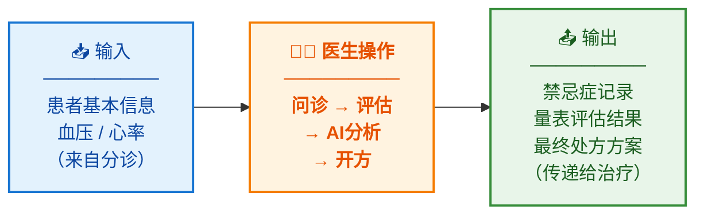

# 医生诊疗流程图

> 以医生视角描述患者从进入诊室到离开的完整流程，以及与上下游环节的衔接。

---

## 完整诊疗流程


```mermaid
flowchart LR
    %% ── 样式定义 ──
    classDef phase fill:#f0f4ff,stroke:#4a6fa5,stroke-width:2px,color:#1a1a2e,font-weight:bold
    classDef step fill:#ffffff,stroke:#6c8ebf,stroke-width:1.5px,color:#2d3748
    classDef key fill:#fff3e0,stroke:#e6a23c,stroke-width:2px,color:#5a3e00,font-weight:bold
    classDef ai fill:#f3e8ff,stroke:#9b59b6,stroke-width:2px,color:#4a1a6b
    classDef transfer fill:#e8f5e9,stroke:#4caf50,stroke-width:2px,color:#1b5e20,font-weight:bold
    classDef warn fill:#fff8e1,stroke:#ff9800,stroke-width:1.5px,color:#e65100

    %% ══════════════ 分诊阶段 ══════════════
    subgraph TRIAGE ["🏥 分诊阶段"]
        direction LR
        T1["患者刷医保卡<br>登记个人信息"]:::step
        T2["测量血压、心率<br>等基础生理指标"]:::step
        T3["进入候诊队列<br>等待叫号"]:::step
        T1 --> T2 --> T3
    end
    TRIAGE:::phase

    %% ══════════════ 数据传递 ══════════════
    T3 --> DATA1

    DATA1(["📋 传递：患者信息 + 生理数据"]):::transfer

    DATA1 --> D1

    %% ══════════════ 医生诊疗阶段 ══════════════
    subgraph DOCTOR ["👨‍⚕️ 医生诊疗阶段"]
        direction TB
        D1["① 系统叫号<br>下一位患者"]:::step
        D2["② 刷医保卡<br>核实身份、调出信息"]:::step
        D3["③ 禁忌症问诊<br>询问并录入禁忌症"]:::step
        D4["④ 量表评估<br>问答采集情绪/症状"]:::step
        D5["⑤ AI 辅助分析<br>生成处方建议"]:::ai
        D5N["⚠️ 仅供医生参考<br>不向患者展示"]:::warn
        D6["⑥ 调整处方<br>结合经验修改参数"]:::key
        D7["⑦ 确认下达处方"]:::key

        D1 --> D2 --> D3 --> D4 --> D5
        D5 -.- D5N
        D5 --> D6 --> D7
    end
    DOCTOR:::phase

    %% ══════════════ 数据传递 ══════════════
    D7 --> DATA2

    DATA2(["📋 传递：处方 + 禁忌症 + 量表"]):::transfer

    DATA2 --> TR1

    %% ══════════════ 治疗阶段 ══════════════
    subgraph TREAT ["💊 治疗阶段"]
        direction TB
        TR1["护士核实身份<br>及处方信息"]:::step
        TR2["执行治疗"]:::step
        TR3["复测血压、心率"]:::step
        TR4["治疗后量表评估"]:::step
        TR5["患者完成治疗<br>离院"]:::step
        TR1 --> TR2 --> TR3 --> TR4 --> TR5
    end
    TREAT:::phase
```

---

## 医生环节数据流向


```mermaid
flowchart LR
    classDef input fill:#e3f2fd,stroke:#1976d2,stroke-width:2px,color:#0d47a1
    classDef process fill:#fff3e0,stroke:#f57c00,stroke-width:2px,color:#e65100,font-weight:bold
    classDef output fill:#e8f5e9,stroke:#388e3c,stroke-width:2px,color:#1b5e20

    IN["📥 输入<br>─────────<br>患者基本信息<br>血压 / 心率<br>（来自分诊）"]:::input
    PROC["👨‍⚕️ 医生操作<br>─────────<br>问诊 → 评估<br>→ AI分析<br>→ 开方"]:::process
    OUT["📤 输出<br>─────────<br>禁忌症记录<br>量表评估结果<br>最终处方方案<br>（传递给治疗）"]:::output

    IN --> PROC --> OUT
```
```

所有 `\n` 都换成了 `<br>`，渲染就正常了。